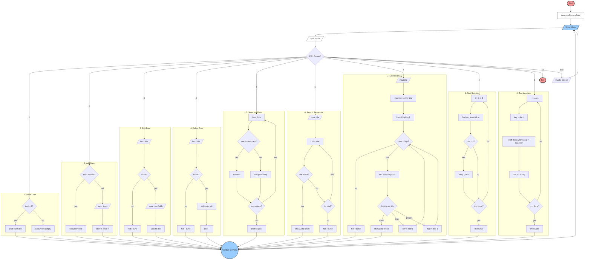

<p align="center"><a href="https://go.dev" target="_blank"></a></p>
<h1 align="center">📁 Sistem Informasi Inventaris Dokumen Skripsi (SkripsIn)</h1>
<p align="center">
  Kelola arsip tugas akhir mahasiswa dari terminal. SkripsIn melacak judul skripsi, penulis, dan tahun kelulusan. Dirancang untuk staf administrasi program studi dan petugas perpustakaan.
</p>

---

## Catatan Penting
 
- Instal [Go 1.18+](https://go.dev/dl) sebelum menjalankan aplikasi.
- Berjalan di terminal. Tanpa browser, tanpa database eksternal.
- Ganti spasi dengan underscore (`_`) saat input data. Contoh: `ini_Budi`.

---
 
## Instalasi
 
1. Clone repository
```bash
git clone https://github.com/MuhamadMatin/tubesGo.git
cd tubesGo
```
 
2. Pastikan Go terinstal
```bash
go version
```
*(Unduh di [https://go.dev/dl](https://go.dev/dl) jika belum terinstal).*
 
3. Jalankan aplikasi
```bash
go run .
```
 
4. Build menjadi executable (opsional)
```bash
# Build
go build -o skripsin main.go
 
# Linux / macOS
./skripsin
 
# Windows
skripsin.exe
```
 
---

## Alur Program



---
 
## Data Dummy
 
SkripsIn memuat 10 data awal saat start:
 
| ID | Nama Mahasiswa | Topik           | Judul Penelitian        | Pembimbing   | Tahun | Status   |
|----|----------------|-----------------|-------------------------|--------------|-------|----------|
| 1  | Budi           | AI              | Face_Recognition        | Pak_Sutrisno | 2023  | ✅ Lulus |
| 2  | Siti           | Web             | E-Commerce_Optimization | Bu_Ratna     | 2024  | ❌ Belum |
| 3  | Andi           | Network         | 5G_Security             | Pak_Sutrisno | 2023  | ✅ Lulus |
| 4  | Rina           | Mobile          | Flutter_UI_Testing      | Pak_Budi     | 2024  | ✅ Lulus |
| 5  | Joko           | Data_Science    | Predictive_Analysis     | Bu_Ratna     | 2022  | ✅ Lulus |
| 6  | Ayu            | IoT             | Smart_Farming           | Pak_Anton    | 2025  | ❌ Belum |
| 7  | Candra         | Cyber_Security  | Malware_Detection       | Pak_Anton    | 2023  | ✅ Lulus |
| 8  | Dewi           | Game_Dev        | Procedural_Generation   | Bu_Siska     | 2024  | ❌ Belum |
| 9  | Eko            | Cloud_Computing | Docker_Orchestration    | Pak_Budi     | 2022  | ✅ Lulus |
| 10 | Fajar          | Blockchain      | Smart_Contracts         | Bu_Siska     | 2025  | ❌ Belum |
 
---

## Tech Stack

| Layer    | Teknologi                                        |
| -------- | ------------------------------------------------ |
| Bahasa   | [Go (Golang)](https://go.dev)                    |
| I/O      | [fmt](https://pkg.go.dev/fmt)                    |
| Struktur | Array statis, Struct                             |
| Output   | Command Line Interface (CLI)                     |
